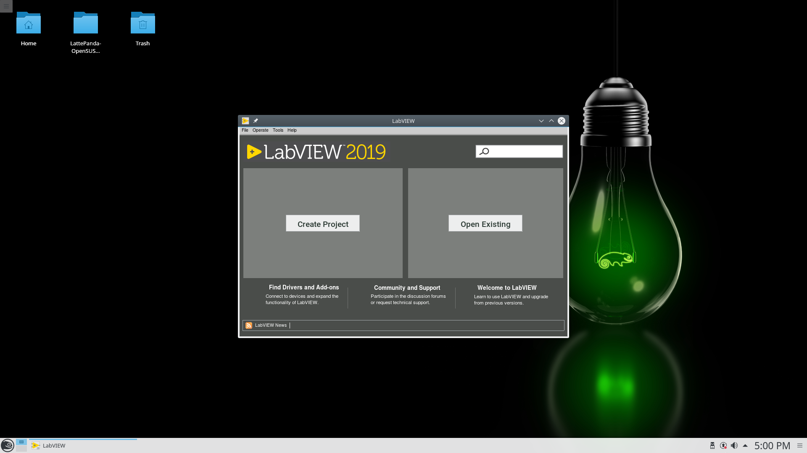

# OpenSUSE Leap 42.3 and LabVIEW 2019 Installation on LattePanda Steps

This is a guide to installing OpenSUSE Leap 42.3 and LabVIEW 2019 onto your LattePanda.

### Prerequisites

These downloads can be either on your local computer and then use SCP to transfer them onto the remote computer, or can be downloaded straight onto the remote computer.

**Download these files from these links.**
1. Install BalenaEtcher from this [link](https://www.balena.io/etcher/).

**OpenSUSE and LabVIEW Option 1:** Download OpenSUSE Leap 42.3 DVD and LabVIEW 2019 from IMT Lab Dropbox.

1. openSUSE-Leap-42.3-DVD-x86_64.iso
2. lv2019full-linux-mac.iso

**OpenSUSE and LabVIEW Option 2:** Follow links below to download OpenSUSE Leap 42.3 DVD and LabVIEW 2019 independently. Note, these links may lead to newer releases of the software and may cause issues during installation.

1. Download OpenSUSE Leap 42.3 DVD from this [link](http://cdimage.debian.org/mirror/opensuse.org/distribution/leap/42.3/iso/).
2. Download LabVIEW 2019. You must have a valid license with National Instruments for the LabVIEW software.


### Installing OpenSUSE Leap 42.3

**NOTE: All of the following steps must be done on the LattePanda.**

A step by step guide that tell you how to install OpenSUSE Leap 42.3. Make sure ethernet is plugged in.

1. Burn the .iso file onto the USB using BalenaEtcher.
2. Insert the USB into the LattePanda.
3. Upon startup of LattePanda press ESC to get to BIOS.
4. Select the USB media as the boot option in boot override.
5. Refer to this [guide](https://cloudyday.tech.blog/2018/08/19/lattepanda/) if you need visual help.
6. Upon the OpenSUSE start up, press ‘e’ to get to Minimum Emacs-like screen editor.
7. Change the line `linuxefi /boot/x86_64/loader/linux splash=silent` to `linuxefi /boot/x86_64/loader/linux splash=silent textmode=1`.
8. Press F10 to begin installation process.
9. When you see green loading bars, press the UP arrow to get to terminal/YAST2 installer.
10. Follow on-screen installation instructions:
    - Navigate with (TAB, ENTER, arrow keys).
    - Select [Next] to accept license and English format.
    - Set partitioning.
        - Select [Create Partition Setup...].
        - Select the internal hard disk (/dev/mmcblk0).
        - Select [Use Entire Hard Disk].
        - Select [Next] to accept partitioning.
    - Select Region: USA and Time Zone: Pacific (Los Angeles) then select [Next].
    - Select [Next] to accept default User Interface.
    - Set user credentials then Select [Next].
        - Enter information.
        - Leave all other defaults.
        - Allow short password if desired.
    - Change installation settings to allow SSH.
        - Select [Change...].
        - Select [Firewall and SSH...].
        - Enable SSH Service and open SSH port.
        - Select [Install] to continue installation.
11. Remove installation media after installation is complete.
12. Log into the system.
13. Disable the internal display output called DSI-1. Open a terminal by either right-clicking on the Desktop and opening one or using the start menu in the bottom left corner. NOTE: You can also fix this in the GUI by pressing opening the start menu and searching for "Displays". Then disable the internal display output called DSI-1.
```
xrandr --output DSI-1 --off
```
14. Update system.
```
sudo zypper refresh
sudo zypper update
```
15. Enable SSH for the LattePanda.
```
which sshd
sudo zypper in openssh
cat /etc/sysconfig/SuSEfirewall2 | grep sshd
system ctl status sshd
systemctl enable sshd
```

### Installing LabVIEW 2019

**NOTE: These commands were meant to be done through an SSH connection to the LattePanda from a remote computer. They can be done from the Desktop GUI as well with slight modfication. I reccomend doing them on the LattePanda and NOT on a remote connection.**

A step by step guide that tell you how to install LabVIEW 2019.

1. Open a terminal on your local computer and SSH into the LattePanda.
```
ssh [USER]@[IP_ADDRESS]
```

2. Install the Linux command.
```
sudo zypper in git
```

3. Open a different terminal than your current SSH terminal (leave it open). In the new terminal, copy the LabVIEW iso file from your local computer onto the LattePanda.
```
scp LabVIEW2019SP1f1Patch.dmg [USER]@[IP_ADDRESS]:/home/[USER]]/Downloads
scp lv2019full-linux-mac.iso [USER]@[IP_ADDRESS]:/home/[USER]/Downloads
```
3. Go back to the terminal that has the SSH connection open. Install LabVIEW using installation script located in the this repository.
```
sh install_labview.sh
```
4. Check if LabVIEW has been installed. Either open LabVIEW on the LattePanda GUI or check if the command below runs in the terminal.
```
./labview
```




## Errors

* None

### System Notes

* None

## Built With

* OpenSUSE Leap 42.3 - The OS used
* LabVIEW - LabVIEW application software

## Contributing

* None

## Versioning

* None

## Authors

* **Imran Matin** - [Github Profile](https://github.com/imranmatin23)

## License

* None

## Acknowledgments

* None

